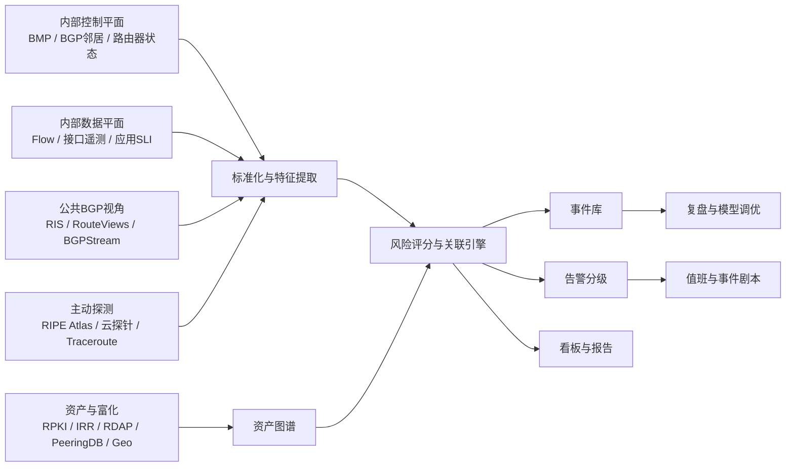

## 执行摘要

本文面向这样一种现实约束：组织内部已经拥有较丰富的网络设备、BGP、流量与服务遥测，但对外部互联网的可见性有限，**只能依赖公共 collector 观察其他 AS 的控制平面**。在这种条件下，最有效的策略不是试图“复制互联网全景”，而是把**内部遥测当作主证据**，把公共 BGP collector 当作**外部佐证与范围估计器**，再辅以低成本主动探测与有限的地理/灾害/海缆上下文，构建“**内部真相优先、外部证据加权**”的风险评分体系。

本文显式采用以下假设。第一，组织可以从边界路由器或 route reflectors 导出 **BMP** 或至少拿到 BGP 邻居状态；这与 [RFC 7854](https://www.rfc-editor.org/rfc/rfc7854.html) 的监测模型一致。第二，组织具备至少一种流量遥测：NetFlow、IPFIX、sFlow、接口流式遥测、或等价的服务指标。第三，组织至少有一份可维护的前缀与服务映射表，否则“事件到业务影响”的闭环无法成立。第四，外部可用资源限于 [RIS / RIS Live](https://www.ripe.net/analyse/internet-measurements/routing-information-service-ris/)、[RouteViews](https://api.routeviews.org/docs/)、[BGPStream](https://bgpstream.caida.org/) 及其衍生解析工具；不假设存在付费全球 BGP feed。第五，主动探测默认以低成本方式实现，例如少量云主机探针、[RIPE Atlas](https://atlas.ripe.net/) 或已有边缘节点。第六，海缆和船舶等外部事件数据的公共覆盖不完整，因此应作为**情境信号**而不是单独定责依据。

建设重点应放在三件事上。第一，建立**前缀—ASN—上游—站点—服务**资产图谱。第二，把内部控制平面与数据平面整合成统一事件总线，再用公共 collector 做“外部是否也看到了”的确认。第三，采用**风险分数 + 置信度**双轨输出，而不是单一真假判断。这样做的原因很简单：在公共视角有限的前提下，真正可靠的不是“我是否能看见整个互联网”，而是“我能否高置信度判断这次事件是否正在影响我的业务”。

## 实现架构

在资源受限、但内部遥测很强的场景下，架构设计应明确分层：**内部控制平面**、**内部数据平面**、**公共 BGP 视角**、**主动探测**、**资产与富化**、**统一检测与告警**。其中，内部数据是主轴，公共 collector 主要回答两个问题：外部是否也观察到了这次变化，以及影响范围是否超出本 AS。

内部控制平面建议接入三类信号：边界路由器或 RR 的 BMP 路由视图、BGP 邻居状态与 flap 事件、设备接口与光模块/丢包计数。内部数据平面建议至少接入四类信号：NetFlow/IPFIX/sFlow、关键应用 SLI/SLO、合成探测（ICMP/TCP/HTTP/TLS）、以及按站点/地域聚合的流量与错误率。外部控制平面则接入 [RIS / RIS Live](https://www.ripe.net/analyse/internet-measurements/routing-information-service-ris/)、[RouteViews](https://api.routeviews.org/docs/) 与 [BGPStream](https://bgpstream.caida.org/)；如果需要高效解析历史 MRT，可加入 [BGPKIT](https://bgpkit.com/)。富化层应至少包含 RPKI、IRR、RDAP、组织映射和地理信息；RPKI 的定义与校验语义见 [RFC 6480](https://www.rfc-editor.org/rfc/rfc6480.html) 与 [RFC 6811](https://www.rfc-editor.org/rfc/rfc6811.html)，IRR/RPSL 见 [RFC 2622](https://www.rfc-editor.org/rfc/rfc2622.html)。

部署上，资源受限时不建议一开始就引入重型总线。一个足够实用的最小实现是：BMP 与公共 collector 解析进对象存储或本地归档；规范化后的事件写入 PostgreSQL 或 ClickHouse；实时规则由 Python/Go 消费器执行；看板使用 Grafana。若已有消息总线，再把事件以 topic 方式拆分会更稳妥，但不是起步必要条件。

## 风险评分框架

### 输入信号

风险评分应同时考虑控制平面、数据平面、业务暴露和外部环境。建议将信号分成四组：

| 信号组 | 代表输入 | 主要意义 |
| --- | --- | --- |
| 控制平面 | origin 变化、RPKI `Invalid`、withdraw 突增、路径编辑距离、相邻上游变化、公共 collector 可见性变化 | 判断“路由语义与可达性声明”是否异常 |
| 数据平面 | 站点/地域流量跌幅、丢包率、RTT、重传、SYN 成功率、HTTP/TLS 可用性、traceroute 分叉 | 判断“用户和业务是否真的受到影响” |
| 依赖与业务 | 前缀关键度、服务关键度、流量占比、上游集中度、地区暴露、是否处于变更窗口 | 判断“异常是否值得升级” |
| 外部情境 | 地震、海缆事故、船锚/AIS、天气、第三方运营商公告、公共 outage 报告 | 帮助解释“为什么正在发生” |

### 特征工程与打分

建议用**分层打分**，而不是单一线性模型。一个实用的设计是先算三个子分数，再合成总风险。

- 控制平面分数 `CP`：  
  `CP = 0.30*origin_mismatch + 0.20*rpki_invalid + 0.20*visibility_loss + 0.15*path_novelty + 0.15*withdraw_burst`
- 数据平面分数 `DP`：  
  `DP = 0.35*traffic_drop + 0.25*latency_jump + 0.20*loss_jump + 0.20*service_error`
- 情境与暴露分数 `CTX`：  
  `CTX = 0.35*asset_criticality + 0.25*transit_dependency + 0.20*geo_overlap + 0.20*external_context`

然后计算基础风险：

`RiskBase = 100 * (0.45*CP + 0.40*DP + 0.15*CTX)`

再引入置信度修正：

`RiskAdj = RiskBase * (0.5 + 0.5*Confidence)`

这里 `Confidence` 不是“严重度”，而是“我们对判断是否成立有多大把握”。建议定义为：

`Confidence = 0.30*source_diversity + 0.25*internal_external_agreement + 0.20*mapping_quality + 0.15*duration_stability + 0.10*historical_consistency`

各项均归一化到 0–1。这样做的优势是：即使事件看起来很严重，如果只来自单一公共 collector 或映射关系并不可靠，也不会过早升级为致命告警。

### 阈值与告警分层

| 风险层级 | RiskAdj | Confidence | 行动 |
| --- | --- | --- | --- |
| 信息 | 0–29 | 任意 | 记录与展示，不打断值班 |
| 观察 | 30–49 | ≥0.35 | 进入待确认队列，自动补充主动探测 |
| 重要 | 50–69 | ≥0.50 | 创建事件，通知 NetOps/SRE |
| 高危 | 70–84 | ≥0.60 | 值班升级，启动对应剧本 |
| 严重 | ≥85 | ≥0.70 或命中关键规则 | 立即拉起跨团队响应 |

关键规则例外应单独定义，例如：**关键前缀出现未经授权 origin 且 RPKI 为 `Invalid` **，即使数据平面尚未明显受损，也应直接进入“高危”。

## 事件映射方法

### 把 ASN 事件映射到公司前缀

在只能通过公共 collector 观察其他 AS 的前提下，映射的核心不是“还原外部全拓扑”，而是把外部事件投影到**公司已知资产集合**。建议流程如下：

| 步骤 | 方法 | 数据源 |
| --- | --- | --- |
| 建立资产基线 | 维护 `prefix -> expected_origin -> upstream -> site -> service` 映射 | 内部 CMDB、路由配置、ROA、IRR、RDAP |
| 建立外部基线 | 为每个关键前缀保存过去 7–30 天的公共可见性、常见 AS_PATH 模式、常见第一跳外部上游 | RIS、RouteViews、BGPStream |
| 事件归并 | 将公共 BGP 事件按 prefix/origin/时间窗聚合 | BGPStream、BGPKIT |
| 前缀匹配 | 先精确匹配，再做 super/sub-prefix、MOAS 白名单、托管/代播白名单匹配 | 内部前缀表、ROA、IRR |
| 影响判定 | 用内部 BMP 与 Flow 验证该前缀或资产组是否同时出现路径/流量异常 | BMP、Flow、应用探测 |
| 上游归因 | 将公共路径变化与内部 eBGP 邻居、社区、本地优先级和出入口统计对齐 | BMP、router telemetry、public AS_PATH |
| 不确定回退 | 若单前缀证据不足，回退到聚合前缀、同站点、同上游或同地域级别判断 | 资产图谱、历史基线 |

### 传输链路映射启发式

“哪条 transit link 受影响”往往比“哪个前缀受影响”更难，因为公共视角只能看到 AS 级逻辑路径。一个务实的启发式是：

1. 用内部 BMP 建立 `prefix -> border router -> eBGP neighbor -> transit provider -> metro/site` 真值表。
2. 用公共 collector 为每个关键前缀维护“**外部第一跳与第二跳签名**”，例如最常见的 `... -> ProviderA -> CompanyASN` 或 `... -> IXP RS -> ProviderB -> CompanyASN`。
3. 发生事件时，先在内部看是否出现邻居 flap、local-pref 改变、best-path 切换或某出口流量陡降。
4. 再在公共视角看 AS_PATH 是否出现新的上游、是否从常见上游切到少数路径、是否可见性在某地区 collector 上明显下跌。
5. 若两侧都指向同一上游/站点，则可将事件映射到具体 transit link；若只在公共面看到而内部无对应变化，则先标记为“外部传播异常，内侧未证实”。

### 回退规则与局限

当关键前缀在公共视角中几乎不可见时，应按以下顺序回退：

- 同一聚合前缀中的兄弟前缀；
- 共用同一 origin 或同一上游的前缀组；
- 同一站点或同一地域出口；
- 主动探测的业务终点与 anycast 节点；
- 最后才回退到组织级或区域级事件。

局限必须明确写进系统说明。公共 collector 无法完整覆盖互联网；IX route server、私有互联、MPLS/TE、隐藏对等、MOAS、CDN/云代播都会降低链路推断可信度。因而“传输链路映射”应始终带置信度，而不是硬性断言。

## 外部非网络因子并入风险评分

海缆、地震、船锚、天气和第三方运营商通告，不应被当作独立告警源，而应被当作**解释增强器**。它们最适合回答“这次区域性退化是否有现实世界触发因素”。

对低成本部署，建议采用以下数据源分层：

| 因子 | 建议数据源 | 用法 |
| --- | --- | --- |
| 地震 | [USGS Earthquake Feeds]( https://earthquake.usgs.gov/earthquakes/feed/ )、[GDACS](https://www.gdacs.org/) | 提取震级、深度、坐标、时间，与站点/landing region 做空间相关 |
| 海缆 | 电缆运营商公告、 landing station 官方资料、行业参考如 [TeleGeography Submarine Cable Map](https://www.submarinecablemap.com/) | 建立区域与 landing zone 依赖，不用于单独定责 |
| 船舶/船锚 | 公开 AIS/海事数据源、港口/海事部门信息；覆盖不足时仅做辅助 | 判断事故时段内是否有异常停留或锚泊活动 |
| 天气/灾害 | 国家气象/灾害机构公开 feed | 解释区域性电力/登陆站受扰 |
| 第三方网络状态 | 上游/IXP 官方状态页、工程公告、维护通知 | 提高事件确认速度 |

建议统一做 0–1 归一化，再时间衰减。可采用如下简单函数：

- 地震影响：`quake_score = magnitude_factor * exp(-distance_km / 300) * exp(-hours / 24)`
- 海缆事件：`cable_score = source_reliability * geo_overlap * exp(-hours / 48)`
- 船锚/AIS：`anchor_score = proximity_factor * dwell_factor * exp(-hours / 12)`
- 第三方确认：`third_party_score = min(1, log(1+n)/log(1+5)) * exp(-hours / 24)`

相关窗口建议不要过长。地震与突发 outage 通常以 **0–6 小时** 为主窗口，扩展观察到 24 小时；海缆与船锚相关事件通常以 **0–48 小时** 为主窗口，最长观察到 72 小时；运营商公告与维护通知的影响可按 **当天到 7 天** 窗口做状态标记。最关键的一点是：**只有当地理区域与受影响前缀/站点/上游显著重叠时，外部因子才应提升风险分数**，不能因为“世界上某处发生了地震”就自动提高全网告警。

## 轻量部署与事件剧本

### 轻量部署路线

| 时间窗口 | 目标 | 优先交付物 |
| --- | --- | --- |
| 0–30 天 | 建立最小可用链路 | 前缀与服务映射表、BMP/邻居状态接入、RIS/RouteViews/BGPStream 接入、Grafana 基础风险面板、RPKI 校验 |
| 30–90 天 | 形成可操作告警 | Flow/应用 SLI 接入、RiskAdj 评分、主动探测、origin/route-leak/upstream 三类初版剧本、值班阈值 |
| 90–180 天 | 引入外部情境与回归调优 | 海缆/地震/第三方公告关联、误报回顾、置信度校准、路径依赖分析、区域化 dashboards |

成本控制上，建议优先采用 [OpenBMP](https://www.openbmp.org/)、[BGPStream](https://bgpstream.caida.org/)、[BGPKIT](https://bgpkit.com/)、[BGPalerter](https://github.com/nttgin/BGPalerter)、[Routinator](https://routinator.docs.nlnetlabs.nl/) 等开源组件。RPKI 校验建议用 NLnet Labs 的 [Routinator](https://routinator.docs.nlnetlabs.nl/)。互联与运营富化可接入 PeeringDB 的 [PeeringDB](https://www.peeringdb.com/)，注册信息优先用 ARIN 所支持的 [RDAP/IRR](https://www.arin.net/resources/manage/irr/) 生态与其他 RIR 来源。

### 事件剧本

| 场景 | 步骤 |
| --- | --- |
| Origin hijack | 先看内部 BMP 是否出现非预期 origin 或 best-path 切换；核对 ROA 是否转为 `Invalid`；再用 RIS/RouteViews 确认是否多地可见；用主动探测验证业务终点可达性；若命中关键前缀，立即通知上游过滤、必要时宣布更具体前缀或切换代播；保留证据用于复盘。 |
| Route leak | 检查内部导出策略与近期变更；看公共 AS_PATH 是否出现异常 provider/peer 传播迹象，参照 [RFC 7908](https://www.rfc-editor.org/rfc/rfc7908.html) 与 [RFC 9234](https://www.rfc-editor.org/rfc/rfc9234.html) 语义；若内部流量/时延已受影响，降低受影响路径本地优先级、切换出口、联系涉事上游；持续用 collector 观察泄漏是否收敛。 |
| Upstream/IXP outage | 内部先看邻居状态、接口错误、出口流量和 RTT；公共面再看关键前缀可见性 cliff 是否集中在某地区 collector；用 traceroute 判断是否切到备份路径；若确认单上游/IXP 受扰，执行预案 local-pref 调整、社区引流、通知业务方观察区域影响。 |
| 海缆区域性 outage | 先观察是否出现地域集中流量跌幅、延迟上升、跨洋路径绕行；再将受影响站点/上游与海缆 landing region、地震/公告/AIS 进行相关；若置信度提升，按区域进行流量转移、应用降级、CDN/边缘策略调整，并联系 carrier 获取正式 ETR；在恢复期持续跟踪路径回切与质量抖动。 |

## 指标、看板与工具映射

### 监控 KPI 与看板

最有用的看板不是“世界发生了多少 BGP 事件”，而是“这些事件对我有什么影响”。建议核心 KPI 如下：

| KPI | 定义 | 目标 |
| --- | --- | --- |
| 检测时延 | 从内部/外部首次异常到生成事件的时间 | 越低越好 |
| 置信度命中率 | 高置信事件中最终被人工确认的比例 | 持续上升 |
| 误报率 | 告警后被判定为正常变更或无业务影响的比例 | 持续下降 |
| 路径归因成功率 | 能映射到具体前缀组/上游/站点的事件比例 | 持续上升 |
| 关键前缀覆盖率 | 已纳入基线和评分体系的关键前缀比例 | 接近 100% |
| RPKI 覆盖率 | 关键前缀中已有 ROA 且定期校验的比例 | 持续上升 |
| 主动探测验证率 | 高风险事件被主动探测二次确认的比例 | 高于 80% |

看板建议最少包含五块：**Top Risk 事件表**、**风险趋势与置信度散点图**、**受影响前缀/服务/地域**、**路径变化与上游归因**、**建议缓解动作**。最后一块非常重要：值班人员不需要每次从头推理，系统应直接给出“建议检查 ROA”“建议比较出口 A/B 流量”“建议联系上游 X”这类动作提示。

### 工具映射

| 功能 | 推荐 OSS | 可选商业 | 备注 |
| --- | --- | --- | --- |
| 内部 BGP/BMP 采集 | [OpenBMP](https://www.openbmp.org/)、[ExaBGP](https://github.com/Exa-Networks/exabgp) | — | OpenBMP 适合做内部真值入口 |
| 公共 BGP 采集 | [BGPStream](https://bgpstream.caida.org/)、[BGPKIT](https://bgpkit.com/)、[RIS](https://www.ripe.net/analyse/internet-measurements/routing-information-service-ris/)、[RouteViews](https://api.routeviews.org/docs/) | [Kentik](https://kb.kentik.com/docs/bgp-monitoring-apis)、[ThousandEyes](https://docs.thousandeyes.com/product-documentation/tests/bgp-tests) | 受限预算下先用公共源 |
| 富化 | [Routinator](https://routinator.docs.nlnetlabs.nl/)、[IRRd](https://irrd.readthedocs.io/)、[PeeringDB](https://www.peeringdb.com/)、RDAP | 商业情报源 | RPKI/IRR/RDAP 是低成本高价值项 |
| 检测与告警 | [BGPalerter](https://github.com/nttgin/BGPalerter) + 自定义规则 | Kentik / ThousandEyes | 建议把 BGPalerter 当作现成规则参考，而不是唯一引擎 |
| 存储 | PostgreSQL / ClickHouse / 对象存储 | 托管时序或日志平台 | 起步阶段优先简单可靠 |
| 可视化 | [Grafana](https://grafana.com/docs/) | 商业 NPM/NPMD | 重点是看板设计，不是工具华丽程度 |
| 事件管理 | [Prometheus Alertmanager](https://prometheus.io/docs/alerting/latest/alertmanager/) + 工单/ChatOps | PagerDuty / ServiceNow | 先把分级和路由做好 |

## 后续阅读

优先阅读标准与基础文档：[RFC 4271](https://www.rfc-editor.org/rfc/rfc4271.html)、[RFC 7908](https://www.rfc-editor.org/rfc/rfc7908.html)、[RFC 9234](https://www.rfc-editor.org/rfc/rfc9234.html)、[RFC 6480](https://www.rfc-editor.org/rfc/rfc6480.html)、[RFC 6811](https://www.rfc-editor.org/rfc/rfc6811.html)、[RFC 7854](https://www.rfc-editor.org/rfc/rfc7854.html)、[RFC 8212](https://www.rfc-editor.org/rfc/rfc8212.html)、[RFC 2622](https://www.rfc-editor.org/rfc/rfc2622.html)。

然后阅读公共测量与数据生态：[BGPStream](https://bgpstream.caida.org/)、[RIS / RIS Live](https://www.ripe.net/analyse/internet-measurements/routing-information-service-ris/)、[RouteViews](https://api.routeviews.org/docs/)、[CAIDA AS Relationships](https://www.caida.org/catalog/datasets/as-relationships/)、[AS Rank](https://asrank.caida.org/)、[RIPE Atlas](https://atlas.ripe.net/)。

再读检测与方法学论文：[HEAP](https://arxiv.org/abs/1607.00096)、[ARTEMIS](https://arxiv.org/abs/1801.01085)、[AS Hegemony](https://arxiv.org/pdf/1711.02805)、[DFOH](https://www.usenix.org/conference/nsdi24/presentation/holterbach)、[IODA](https://www.caida.org/projects/ioda/)、[Destination Unreachable](https://cseweb.ucsd.edu/~snoeren/papers/shutdown-sigcomm23.pdf)。

如果只记住一句实施原则，那就是：**在外部视角有限的条件下，ASN 与前缀级态势感知必须以内网遥测为主、公共 collector 为辅、主动探测为锚、风险与置信度并行输出。** 这样才能把“看见异常”真正变成“判断影响并采取行动”。