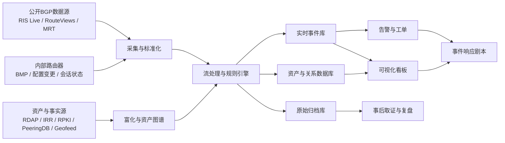
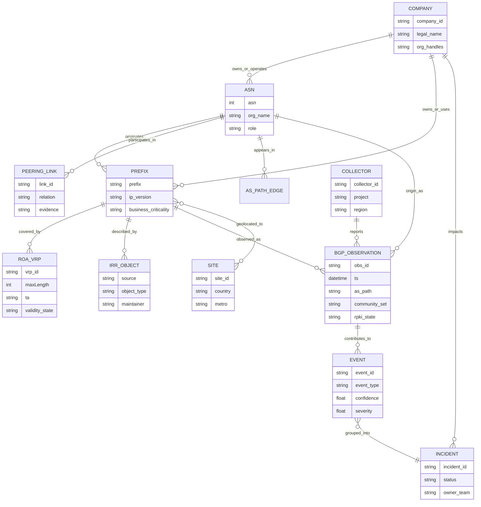

## 执行摘要

ASN 级全球 IP 网络态势感知，关注的不是单台服务器是否在线，而是**互联网控制平面**是否仍按预期运作：你的前缀是否仍由正确的 ASN 起源、路径是否突然绕行、某个上游或交换点是否导致全球可见性骤降、是否出现了疑似前缀劫持或路由泄漏。对没有 IP 网络背景的读者，可以把它理解为“从互联网全局视角监视你的公网资产如何被世界看到”，其核心协议是 [BGP-4（RFC 4271）](https://www.rfc-editor.org/rfc/rfc4271.html)。

本文默认以下假设，并据此给出建议。第一，目标对象是一家**中型公司**，可能拥有自有 ASN，也可能没有自有 ASN 而只是使用自有或托管的公网前缀；如果没有自有 ASN，则监测对象应从“本 ASN”扩展为“本公司使用的前缀 + 代播/托管/云服务相关 ASN”。第二，预算与既有工具**均未指定**，因此建议采用“**开源底座 + 可选商业前台**”的模块化方案。第三，重点是**全球态势感知与事件响应**，而不是深入做流量工程优化或硬件级路由器调优。第四，假定公司能够提供最基本的资产事实：前缀清单、上游清单、关键业务域名/地域、变更窗口和联系人。

从研究与工程实践看，成熟方案都遵循同一原则：**公开 BGP 观测 + 内部 BMP 观测 + 资产事实 + 安全授权数据 + 少量主动探测**。只用公开 collector（如 RIS、RouteViews）可以很快起步，但天然存在视角不完备问题；而只看内部路由器又无法回答“互联网其他地方如何看你”。因此，可靠的系统应同时使用 [BMP（RFC 7854）](https://www.rfc-editor.org/rfc/rfc7854.html)、[RPKI（RFC 6480、RFC 6811）](https://www.rfc-editor.org/rfc/rfc6480.html)、[IRR/RPSL（RFC 2622）](https://www.rfc-editor.org/rfc/rfc2622.html)、[RDAP（RFC 9082）](https://www.rfc-editor.org/rfc/rfc9082.html)、公共 collector，以及业务资产图谱。

若以建设优先级排序，最值得率先落地的检测能力通常是：**起源变化（origin mismatch）**、**RPKI Invalid/覆盖变化**、**可见性骤降**、**路径新颖度异常**、**撤销风暴**、以及**关键上游依赖突增**。对中型公司而言，首选架构不是“堆更多看板”，而是建立一条可追溯的数据链：原始 BGP/BMP 数据进入统一管道，经 RPKI/IRR/RDAP/组织映射/地理信息富化后，形成事件，再进入告警、工单和复盘系统。

## 背景与关键概念

### ASN、BGP、IP 与控制平面

IP 前缀可以理解为一段连续的公网地址空间，例如一个 `/24` IPv 4 网段或一个 `/48` IPv 6 网段。ASN（Autonomous System Number）是自治系统编号，表示一个独立执行外部路由策略的网络实体；[RFC 1930](https://www.rfc-editor.org/rfc/rfc1930.html) 把 AS 作为策略边界来定义。[BGP-4（RFC 4271）](https://www.rfc-editor.org/rfc/rfc4271.html) 是不同 ASN 之间交换路由可达性信息的协议，也是互联网跨网络互联的事实基础。

需要特别区分**控制平面**与**数据平面**。BGP 属于控制平面：它告诉路由器“哪些前缀可达、经过哪些 AS 可达、当前优选路径是什么”。真正的数据包转发路径属于数据平面，未必完全等于你从 BGP AS_PATH 看到的逻辑路径。因此，ASN 级态势感知主要监视的是**可达性声明和路径语义**，而不是具体电路或单跳时延。

最重要的几类路由概念可简化如下：

| 概念 | 含义 | 监测意义 |
| --- | --- | --- |
| eBGP | 不同 ASN 之间交换路由 | 全球态势感知的核心来源 |
| iBGP | 同一 ASN 内传播外部路由 | 用于内部分发，不直接代表全球视角 |
| Announcement | 新增或更新一条路由通告 | 观察前缀出现、起源改变、路径变化 |
| Withdrawal | 撤销一条此前通告的路由 | 观察前缀消失、可见性骤降、上游故障 |
| AS_PATH | 路由通告携带的 AS 序列 | 用于判断路径变化、依赖关系、疑似泄漏 |
| More-specific | 更具体的子前缀通告 | 常见于工程优化，也可用于子前缀劫持 |
| Visibility | 被多少 collector/peer 观测到 | 评估全球可见性与事件严重度 |

### Transit、Peering 与 IXP

在运营关系上，最关键的是 **transit**、**peering** 和 **IXP**。Transit 可以理解为“付费向上游购买互联网可达性”；Peering 则通常是两个网络之间互换彼此前缀或客户锥可达性，而不提供全网传输。IXP（Internet Exchange Point）是一个共享交换基础设施，允许多家网络在同一地点进行双边或多边互联；它是一种**互联设施**，不等于一种业务关系。实际中，Peering 常发生在 IXP，也可发生在私有互联链路上。

这三者的区别对 route leak 判断十分重要。一个典型经验法则是：**客户学到的路由通常可以向上游和对等方传播；从上游或对等方学来的路由通常不能再传播给另一个上游或对等方**。一旦传播边界被错误突破，就可能形成 route leak。这个问题在 [RFC 7908](https://www.rfc-editor.org/rfc/rfc7908.html) 中被系统化定义，在 [RFC 9234](https://www.rfc-editor.org/rfc/rfc9234.html) 中进一步通过 **BGP Roles** 与 **Only-to-Customer（OTC）** 机制给出预防与检测思路。

### RPKI 与 IRR 的区别

RPKI 和 IRR 经常一起被提到，但它们解决的是不同问题。

**RPKI** 是资源公钥基础设施，[RFC 6480](https://www.rfc-editor.org/rfc/rfc6480.html) 规定了其整体架构；[RFC 6811](https://www.rfc-editor.org/rfc/rfc6811.html) 则定义了基于 VRP（Validated ROA Payload）的前缀起源校验。它回答的问题是：**某个 ASN 是否被资源持有者授权起源某个前缀**。结果通常有三种：`Valid`、`Invalid`、`NotFound`。RPKI 的强项是**起源授权的密码学可验证性**，但它默认并不验证完整 AS_PATH。

**IRR** 是互联网路由注册库，主要以 [RPSL（RFC 2622）](https://www.rfc-editor.org/rfc/rfc2622.html) 表达路由策略与对象关系，如 `route`、`route6`、`aut-num` 等。其价值在于帮助网络运营者构建前缀过滤、维护策略对象、追溯运营声明。但 IRR 通常**不是密码学授权机制**，可能存在陈旧、过宽、组织迁移后未更新等现实问题。

两者的差异可用下表快速把握：

| 维度 | RPKI | IRR |
| --- | --- | --- |
| 核心目标 | 验证前缀起源授权 | 记录路由对象与策略声明 |
| 技术基础 | 密码学签名与证书链 | 文本对象库与策略语言 |
| 主要对象 | ROA / VRP | route、route 6、aut-num 等 |
| 优势 | 起源合法性强、可自动验证 | 覆盖面广、对运营策略有用 |
| 局限 | 默认不验证全路径、部署不完全 | 可能陈旧、宽松、非加密授权 |
| 监测用途 | 判定 origin 是否符合授权 | 辅助归属映射、过滤与人工核验 |

工程上，最稳妥的做法不是二选一，而是**同时使用**：RPKI 用于机器可判定的起源合法性，IRR 用于策略补充、归属提示和应急核验。

### BGP Hijack 与 Route Leak

这两个术语经常混用，但严格含义不同。

**BGP hijack（前缀劫持）**，最常见的形式是未经授权地起源一个不属于自己的前缀，或者用更具体的子前缀吸引流量。它通常关注“**谁在宣告这个前缀**”的问题，因此与 RPKI/ROA 的相关性最强。

**Route leak（路由泄漏）**，按 [RFC 7908](https://www.rfc-editor.org/rfc/rfc7908.html) 的定义，是指“路由通告的传播超出了预期策略边界”。它不一定改变起源 AS，但会让路由在错误的业务关系边界间扩散，例如把从上游学到的全表再传播给另一个上游，从而导致大范围流量重定向、拥塞或不可达。[RFC 9234](https://www.rfc-editor.org/rfc/rfc9234.html) 试图通过对等角色编码和 OTC 标记抑制这类问题。

一个简单判断法是：**Hijack 更偏“身份不对”**；**Route leak 更偏“传播范围不对”**。前者主要伤害前缀归属与流量吸引，后者主要伤害策略边界与路径正确性。

### BMP、显式策略与运营安全

[BMP（RFC 7854）](https://www.rfc-editor.org/rfc/rfc7854.html) 是面向监测系统的协议，用于把路由器收到和选出的 BGP 路由视图导出给外部收集器。它的意义非常大：公开 collector 能告诉你“互联网外部如何看你”，而 BMP 能告诉你“你的设备自己到底收到了什么、选了什么、何时变化”。

另一个经常被忽视的基础安全要求是 [RFC 8212](https://www.rfc-editor.org/rfc/rfc8212.html)：eBGP 邻居默认不应在没有明确入站和出站策略的情况下交换路由。这条规则非常适合用来解释很多现实事故：并不是 BGP 天生不安全，而是**策略显式性不足**常常导致错误传播。

对于实际部署者，还应参考 [RFC 7454](https://www.rfc-editor.org/rfc/rfc7454.html) 的 BGP OPSEC 建议，以及 [RFC 9319](https://www.rfc-editor.org/rfc/rfc9319.html) 对 ROA `maxLength` 保守使用的提醒。

## 文献与行业综述

ASN 级威胁与 outage 监测，大体可以分成五条研究主线：**AS 关系与组织映射**、**公开 BGP 数据基础设施**、**劫持/泄漏检测**、**RPKI/ROV 实证研究**、以及**大规模断网/关网识别**。在这方面，**CAIDA** (internet measurement, us)、**RIPE NCC** (internet registry, netherlands)、**IETF** (standards body, us)、**USENIX** (systems conference org, us)、**ACM** (computing association, us) 和 **IEEE** (engineering association, us) 是最值得优先依赖的来源生态。

下面列出代表性工作及其对建设的直接启示：

| 工作名 | 关注问题 | 核心方法 | 对建设的启示 |
| --- | --- | --- | --- |
| [AS Relationships Dataset / CAIDA](https://www.caida.org/catalog/datasets/as-relationships/) | provider/customer/peer 关系推断 | 基于 BGP 路径、社区值、RPSL、traceroute 与多方校验推断 AS 关系 | 不理解 AS 关系，就很难稳健识别 route leak 与上游依赖 |
| [BGPStream / CAIDA](https://bgpstream.caida.org/) | 大规模 BGP 历史/实时处理 | 统一访问 RouteViews、RIS、RIS Live 等数据源，支持过滤、拉流与编程分析 | 工程上应先把公开数据接成统一数据管道，而不是手工拼接数据源 |
| [Argus](https://dl.acm.org/doi/10.1145/2398776.2398779) | 快速检测前缀劫持 | 联合控制平面与数据平面，快速判断前缀异常是否构成真实影响 | 只看 BGP 变化不够，还要用 reachability/测量做二次确认 |
| [HEAP](https://arxiv.org/abs/1607.00096) | 降低劫持告警误报 | 结合 IRR、拓扑推理、TLS 证据等对 hijack alarm 做后验消歧 | 告警系统不能只靠单一规则，必须多证据融合 |
| [ARTEMIS](https://arxiv.org/abs/1801.01085) | 由被影响 AS 自主快速检测与缓解 hijack | 依赖实时公共监测流，强调受害方自主检测、自主触发缓解 | 对企业来说，“自助型检测+处置”比完全外包更可靠 |
| [BGP Hijacking Classification / Serial Hijackers](https://www.iijlab.net/en/members/romain/pdf/cho_tma2019.pdf) | 劫持类型分类与重复攻击者画像 | 对多种劫持模式进行分类，分析长期重复性行为 | 告警要分型；不同异常需要不同严重性与处置剧本 |
| [Peerlock / Peerlock-lite](https://www.ndss-symposium.org/wp-content/uploads/ndss2021_1A-1_23080_paper.pdf) | 抑制 route leak 扩散 | 通过关系感知过滤与泄漏抑制策略减少错误传播范围 | 监测之外，还要考虑与上游协作的预防性过滤 |
| [RPKI is Coming of Age](https://www.khoury.northeastern.edu/home/amislove/publications/RPKI-IMC.pdf) | RPKI 覆盖率、误配置与演进 | 长期测量 ROA 与起源校验状态，分析部署趋势与配置问题 | 不能把“已创建 ROA”误当成“全网都在替你执行过滤” |
| [RoVista](https://www.iijlab.net/en/members/romain/pdf/weitong_imc2023.pdf) | ROV 实际部署测量 | 以观测基础设施评估哪些网络真正执行 Route Origin Validation | ROV 支持并不均匀，风险评估要按上游/区域具体分析 |
| [IODA](https://www.caida.org/projects/ioda/) | 大规模 outage/Internet disruption 识别 | 融合 BGP、主动探测和背景流量等多类信号识别断网事件 | 宏观 outage 检测应是多源观测，而非只看路由撤销 |
| [Destination Unreachable](https://cseweb.ucsd.edu/~snoeren/papers/shutdown-sigcomm23.pdf) | 区分政府关网与自发 outage | 把 IODA 事件与社会/政治上下文结合建模分类 | 解释“为什么掉线”需要上下文，不能只给技术症状 |
| [DFOH](https://www.usenix.org/conference/nsdi24/presentation/holterbach) | Forged-origin hijack 快速检测 | 从路径合法性与历史行为中识别更隐蔽的假起源攻击 | 新一代对手会规避传统 origin-only 检测，路径语义分析会越来越重要 |
| [AS Hegemony](https://arxiv.org/pdf/1711.02805) | 估计关键 AS 依赖与中心性 | 校正 collector 偏差后衡量某 AS 在路径中的“支配度” | 很适合评估你对哪些 transit AS 依赖过高 |
| [Internet Yellow Pages](https://www.iijlab.net/en/members/romain/pdf/romain_imc2024.pdf) | 互联网数据知识图谱化 | 将 BGP、RPKI、IRR、组织和测量数据整合成可查询图谱 | 企业建设中，资产知识图谱会显著降低归因与排障成本 |

这些工作放在一起，给出的工程结论非常一致。第一，**路由语义比单条事件更重要**。一条路径变化是否危险，往往取决于它是否违反业务关系、ROA 授权或历史基线。第二，**公开 collector 只是必要条件，不是充分条件**。公开视角可以发现大量问题，但无法完整覆盖互联网；内部 BMP、主动探测和业务日志必须参与。第三，**误报控制是核心竞争力**。HEAP、ARTEMIS、RoVista 之类工作共同说明，能够持续运行的系统，不是“发现更多异常”的系统，而是“能把异常压缩成可操作事件”的系统。

## 工具与平台清单

市场与开源生态可以分成四类。第一类是**公共数据底座**，例如 [BGPStream](https://bgpstream.caida.org/)、[RIPE RIS / RIS Live](https://www.ripe.net/analyse/internet-measurements/routing-information-service-ris/)、[RouteViews](https://api.routeviews.org/docs/)；它们提供原始或近实时 BGP 观测。第二类是**解析与监测器**，例如 [BGPKIT](https://bgpkit.com/)、[BGPalerter](https://github.com/nttgin/BGPalerter)、[OpenBMP](https://www.openbmp.org/)、[ExaBGP](https://github.com/Exa-Networks/exabgp)。第三类是**商业可视化与运营平台**，例如 **Kentik** (network observability, us) 和 **ThousandEyes** (network intelligence, us)。第四类是**历史参考项**，例如 [BGPmon](https://www.bgpmon.net/)，更适合作为概念参照而不是新项目首选。

下表以“直接用于态势感知建设”的角度进行比较。部署复杂度的含义是：**低**表示开箱即用或公共服务即可接入；**中**表示需要开发接入或维护轻量服务；**高**表示需要持续运营内部收集、消息总线与数据存储。

| name | OSS/commercial | data sources | metrics | alerting | API | deployment complexity |
| --- | --- | --- | --- | --- | --- | --- |
| [BGPStream](https://bgpstream.caida.org/) | 开源 | RouteViews、RIS、RIS Live、MRT/BMP 数据 | UPDATE/RIB、AS_PATH、社区、时间序列过滤 | 无内建 | C/C++、Python、命令行 | 中 |
| [RIPE RIS / RIS Live](https://www.ripe.net/analyse/internet-measurements/routing-information-service-ris/) | 公共平台 | 全球 RRC collectors 与实时流 | 路由更新、撤销、collector/peer 视角、可见性 | 原生通用告警较少 | WebSocket、数据下载、页面接口 | 低 |
| [RouteViews](https://api.routeviews.org/docs/) | 公共平台 | 全球 collectors、RIB、UPDATE、近实时数据 | 路由快照、邻接/路径、RPKI 相关查询 | 原生通用告警较少 | API、归档、Looking Glass | 低 |
| [BGPKIT](https://bgpkit.com/) | 开源 | 公共 MRT/BMP 归档与流式数据 | Broker 检索、Parser 解析、Monocle 检查/RPKI 校验 | 无内建 | Rust、CLI、Python、REST | 中 |
| [BGPalerter](https://github.com/nttgin/BGPalerter) | 开源 | 公共 BGP 数据源（如 RIS Live；具体以版本文档为准） | hijack、RPKI、可见性、more-specific、新前缀等 | 有，支持多通知渠道 | 配置驱动，部分集成接口 | 低到中 |
| [OpenBMP](https://www.openbmp.org/) | 开源 | 路由器 BMP、外部 BGP 数据导入 | 全量/增量路由、会话状态、历史回放 | 需外接规则或消费端实现 | Kafka 模式、消息总线消费 | 高 |
| [ExaBGP](https://github.com/Exa-Networks/exabgp) | 开源 | 自建 eBGP 邻居会话 | 收发 BGP updates、可编程宣布/撤销 | 无内建 | JSON/Text、STDIN/STDOUT | 中 |
| [BGPmon](https://www.bgpmon.net/) | 商业/历史参考 | 多视角监测与历史平台能力 | 路径变化、起源变化、策略异常 | 有 | 历史 Web/API 能力 | 低到中 |
| [Kentik BGP Monitoring](https://kb.kentik.com/docs/bgp-monitoring-apis) | 商业 | 全球 vantage points，可与流量/性能数据关联 | reachability、path changes、RPKI、事件时间线 | 有 | REST、gRPC、OpenAPI | 低到中 |
| [ThousandEyes BGP Tests](https://docs.thousandeyes.com/product-documentation/tests/bgp-tests) | 商业 | 公共和私有 BGP monitors、全球测试节点 | reachability、path changes、BGP 事件可视化 | 有 | Monitors API、Alerts API | 低到中 |

如何选型，取决于你希望“自己做多少”。如果目标是建立**自主可验证的数据底座**，首选组合通常是 **RIS/RouteViews + BGPStream 或 BGPKIT + BGPalerter + 内部 BMP/OpenBMP**。如果目标是**最快交付**，则可以用商业平台承担界面、工单和多源可视化，再保留最小 OSS 验证链，避免完全依赖单一供应商口径。

## 方法学

### 把 ASN 事件映射到公司前缀

要回答“这次 ASN 事件是否影响我公司”，第一步不是算法，而是**资产映射**。建议建立一份“公网资产事实表”，至少包含：前缀、期望起源 ASN、上游 ASN、云/CDN/托管服务商、国家/地区、业务关键度、ROA 状态、IRR 对象、联系人和变更窗口。

这类映射通常来自以下数据源：

| 数据源 | 主要作用 | 推荐来源 |
| --- | --- | --- |
| 前缀与 ASN 分配信息 | 建立基础资源归属 | [NRO delegated stats](https://www.nro.net/about/rirs/statistics/)、RIR Whois/RDAP |
| 注册与组织信息 | 补充企业实体、联系人、网络对象 | [RDAP / RFC 9082](https://www.rfc-editor.org/rfc/rfc9082.html) |
| 路由策略/对象声明 | 辅助 route/route 6/aut-num 映射 | [IRR / RFC 2622](https://www.rfc-editor.org/rfc/rfc2622.html)、[ARIN IRR](https://www.arin.net/resources/manage/irr/) |
| 起源授权 | 验证 prefix-origin 合法性 | [RPKI / RFC 6480](https://www.rfc-editor.org/rfc/rfc6480.html)、[RFC 6811](https://www.rfc-editor.org/rfc/rfc6811.html) |
| 组织映射与依赖 | 统一品牌/子公司/并购关系 | [CAIDA AS Relationships](https://www.caida.org/catalog/datasets/as-relationships/)、[AS Rank](https://asrank.caida.org/) |
| 互联设施与成员 | 判断 IXP/对等互联上下文 | [PeeringDB](https://www.peeringdb.com/) |
| 地理归属 | 地域影响分析与区域看板 | [Geofeed / RFC 8805](https://www.rfc-editor.org/rfc/rfc8805.html) |
| 实时控制平面观测 | 判断前缀是否被全球看到 | RIS、RouteViews、BMP |

对于“前缀是否属于公司”这件事，现实里往往不能只靠单一字段匹配。更稳妥的做法是建立**加权证据模型**：ROA 授权的期望 origin 权重最高；经过验证的 IRR `route/route6` 和 `aut-num` 次之；RDAP/Whois 组织字段与内部 CMDB/合同清单再次之；长期 BGP 历史中稳定出现的 origin 模式也应作为证据。这样能显著减少因为并购、托管、BYOIP、CDN 代播和云厂商托管带来的误判。

### 把事件映射到传输链路与上游依赖

“影响前缀”与“影响哪条链路/哪个上游”是两件不同的事。前者相对容易，因为前缀是显式对象；后者更难，因为互联网并不存在一份公开、完整、实时的物理和商业链路全景图。

务实的方法应分三层。第一层，用公开 AS_PATH 历史统计出**公司前缀最常见的前一跳 AS**，形成候选上游集合。第二层，用内部 BMP 的 Adj-RIB-In 和选路结果确认真实接收视角。第三层，如路径涉及 IXP 或 route server，再结合 PeeringDB 成员关系、IX 前缀、以及 CAIDA 的 AS 关系数据做辅助判断。这种分层方法不会得到“绝对真相”，但能得到足够有用的**置信度排序**。

### 检测算法与启发式

对中型企业，建议优先使用可解释、可复盘的启发式，而不是一开始就上复杂机器学习。高价值规则通常包括：

| 规则 | 核心逻辑 | 典型用途 |
| --- | --- | --- |
| Origin mismatch | `observed_origin != expected_origin` | 发现疑似劫持、误配置、代播切换 |
| RPKI invalid / coverage change | 当前通告变为 `Invalid`，或 ROA 覆盖消失 | 发现错误 ROA、授权失效、风险暴露 |
| Visibility cliff | 可见该前缀的 collector/peer 数在短时间显著下降 | 发现全球可见性骤降、上游故障、区域性 outage |
| Path novelty | 出现历史很少见的新上游、异常 triplet、异常绕行 | 发现 route leak、绕路、依赖变化 |
| More-specific anomaly | 出现未授权的更具体子前缀 | 发现子前缀劫持或错误拆分 |
| Withdrawal burst | 撤销速率在短时间陡升 | 发现震荡、会话异常、链路问题 |
| Dependency shift | 某 transit AS 的 AS hegemony 或路径占比突然升高 | 发现依赖集中和潜在单点风险 |

其中，**visibility cliff** 与 **dependency shift** 对业务团队尤其有价值，因为它们更接近“会不会影响全球用户访问”的问题；而 **origin mismatch** 与 **RPKI invalid** 更接近安全与配置合规问题。

### 置信度模型

建议每个事件都带一个 `confidence` 字段，而不是用二元“真/假”。一个易于实施的打分模型可以由五类证据组成：**路径证据**、**授权证据**、**多视角证据**、**历史基线证据**、**业务上下文证据**。

一个实用的高层打分思路如下：

- 路径证据：AS_PATH 是否违反历史基线、是否出现不合理的 provider/peer 传播。
- 授权证据：RPKI 是否 `Invalid`；IRR 是否支持当前 origin。
- 多视角证据：事件是否同时被多个 collector、多个地区或内部 BMP 看到。
- 历史基线证据：该前缀是否长期稳定由同一 origin 和同一组上游传播。
- 业务上下文证据：是否处于变更窗口，是否涉及已知 CDN/云/provider 切换。

这类模型的目标不是“数学上完美”，而是让安全、网络和 SRE 团队在告警到来时，能快速区分“值得立刻升级”的异常和“可能只是正常工程变更”的异常。

### 方法局限

ASN 级方法有若干无法回避的局限。第一，公开 collector 只能覆盖互联网的一部分，因此任何“全球可见性”都只是近似估计。第二，IRR 可能陈旧或宽松，不能被当作强授权。第三，RPKI 默认主要验证起源，不直接保证整条 AS_PATH 正确。第四，CDN、Anycast、云代播、MOAS、托管 DDoS 防护和 BYOIP 会让“谁在宣告谁”的关系变得复杂。第五，最新研究已经说明，对手可以设计规避公开监测的攻击，因此**不能把“未被 collector 看到异常”误解释为“没有异常”**。

## 推荐架构与实施路线图

### 目标架构

面向中型公司，最合理的目标不是一次性建设“全能平台”，而是建立一个分层清晰、可逐步演进的体系：**公开控制平面数据**、**内部 BMP 数据**、**资产与授权事实**、**流式检测与富化**、**事件库与看板**、**工单与应急剧本**。

在实现上，数据收集层应同时接入公共源和内部源。公共源可以使用 RIS/RouteViews，通过 BGPStream 或 BGPKIT 做统一解析；内部如有自有边界路由器，应尽快启用 BMP。富化层至少要接入 RPKI validator（如 [Routinator](https://routinator.docs.nlnetlabs.nl/)）、IRR mirror（如 [IRRd](https://irrd.readthedocs.io/)）、RDAP、地理信息与组织映射。存储层建议分三类：**原始归档**（对象存储，保留 MRT/BMP 原始消息）、**分析事件库**（如 ClickHouse/TimescaleDB/OpenSearch 一类时序/分析数据库）、**资产与关系库**（PostgreSQL 或图数据库，保存公司前缀、ASN、ROA、IRR、上游关系与事件关联）。

下面的 ER 图展示了适合长期运营的数据模型骨架：

### 实时检测、可视化与事件响应

实时检测层建议先做规则引擎，而不是过早引入复杂机器学习。优先上线六类检测：`origin_mismatch`、`rpki_invalid`、`visibility_loss`、`path_novelty`、`withdrawal_burst`、`dependency_shift`。这些规则大多可以解释清楚、便于与上游沟通，也容易转化成标准工单模板。

可视化层建议至少有三类看板：一是**资产合规看板**，展示 ROA 覆盖率、IRR 一致性、关键前缀与期望 origin；二是**实时事件看板**，展示当前活跃异常、按国家/区域/业务线聚合的影响；三是**依赖与路径看板**，展示关键前缀的上游和路径变化、AS hegemony、历史可见性。对中型团队来说，Grafana 一类通用看板平台通常足够；如果采用商业方案，则应优先使用其现成事件模型，但保留自有资产表和规则审计。

事件响应方面，建议至少准备四套剧本：

| 场景 | 核心判定 | 立即动作 | 升级条件 |
| --- | --- | --- | --- |
| 疑似前缀劫持 | origin 变化且不在期望集合内，或出现未授权 more-specific | 核对变更窗口、检查 ROA/IRR、联系上游过滤或宣布修复、保存证据 | 涉及关键业务前缀，或多地区同时可见 |
| 疑似 route leak | 路径传播违反业务关系语义，或异常 transit/peer 出现 | 核查自身导出策略、与相关上游/对等方协同过滤、关注流量绕行 | AS_PATH 扩散范围广、伴随性能恶化 |
| 疑似上游/IXP outage | 可见性 cliff、撤销风暴、同上游前缀集中受影响 | 切换备用上游/策略、通知业务方、用主动探测确认用户影响 | 多业务、多地域同时受损 |
| 疑似 ROA/IRR 误配置 | RPKI `Invalid` 或覆盖消失，但路径未明显异常 | 先检查 ROA、`maxLength`、IRR 对象及变更记录 | 关键前缀进入 `Invalid` 且上游已执行 ROV |

### 路线图

在预算和现状未指定的情况下，最稳妥的路线是“先把事实与最小告警做对，再扩展范围和自动化”。

| 时间阶段 | 目标 | 关键交付物 |
| --- | --- | --- |
| 0–30 天 | 建立资产事实与最小观测 | 前缀/ASN 清单、ROA/IRR 基线、RIS/RouteViews 接入、基础看板、关键联系人矩阵 |
| 30–90 天 | 上线高价值规则与值班流程 | origin mismatch、RPKI invalid、visibility loss 告警；升级路径与工单模板；值班手册 |
| 90–180 天 | 引入内部视角与依赖分析 | BMP/OpenBMP、路径新颖度与 withdrawal burst 检测、上游依赖报表、变更对账 |
| 180+ 天 | 自动化与治理化 | 告警去重与聚合、ChatOps/工单集成、供应商评分、月度复盘、演练与 KPI |

如果公司没有自有边界路由器或很难启用 BMP，也不意味着项目不能启动。此时可先以“**前缀为中心**”做全球可见性、起源合法性与第三方上游行为监测；内部缺失的视角，可暂时由少量主动探测和应用层 SLI 进行弥补。

## 缺口、风险与研究机会

这类系统最大的结构性风险，是**观测永远不完整**。公开 collector 再多，也不可能完整覆盖互联网；AS 关系和业务关系也会随地点、流量方向、前缀以及商业安排变化。因此，任何报告都应把结论表达成“置信度较高/中/低”，而不应伪装成绝对事实。

第二个关键风险，是**把 RPKI 能力想得过强**。RPKI 对起源合法性至关重要，但它默认只解决“谁有权起源某个前缀”这一层问题，不自动保证完整路径未被操纵。随着类似 [DFOH](https://www.usenix.org/conference/nsdi24/presentation/holterbach) 这类研究出现，未来的监测系统会越来越强调**路径语义、历史一致性和多视角交叉验证**。

第三个风险，是**企业资产边界本身并不清晰**。并购、子品牌、云托管、CDN、Anycast、DDoS Scrubbing、BYOIP 等都会让“哪些前缀算本公司资产、由谁起源才算正常”这件事变得复杂。对很多团队来说，真正的难点不是 BGP 解析，而是建立一份可信的、持续更新的资产与依赖图谱。

从研究机会看，至少有四个方向值得关注。其一，是**更可靠的 route leak 检测与定位**，减少对静态 AS 关系假设的依赖。其二，是**控制平面与数据平面的联合验证**，把 BGP 变化与 reachability、时延和应用失败率更好地关联。其三，是**更强的知识图谱化与问答能力**，让一线工程师能直接问“这次事件影响哪些国家、哪些业务、哪些上游”。其四，是**对抗性监测鲁棒性**：当攻击者试图规避公开 collector 时，如何通过内部数据、局部主动测量和关系建模保持感知能力。

## 主要来源与后续阅读

如果只能读最少的一组材料，建议按下面顺序开始。

首先读标准与官方基础文档：  
[BGP-4（RFC 4271）](https://www.rfc-editor.org/rfc/rfc4271.html)、[Route Leaks 定义（RFC 7908）](https://www.rfc-editor.org/rfc/rfc7908.html)、[BGP Roles/OTC（RFC 9234）](https://www.rfc-editor.org/rfc/rfc9234.html)、[RPKI 架构（RFC 6480）](https://www.rfc-editor.org/rfc/rfc6480.html)、[前缀起源校验（RFC 6811）](https://www.rfc-editor.org/rfc/rfc6811.html)、[BMP（RFC 7854）](https://www.rfc-editor.org/rfc/rfc7854.html)、[eBGP 显式策略默认（RFC 8212）](https://www.rfc-editor.org/rfc/rfc8212.html)、[RPSL/IRR（RFC 2622）](https://www.rfc-editor.org/rfc/rfc2622.html)、[BGP OPSEC（RFC 7454）](https://www.rfc-editor.org/rfc/rfc7454.html)、[Geofeed（RFC 8805）](https://www.rfc-editor.org/rfc/rfc8805.html)、[RDAP（RFC 9082）](https://www.rfc-editor.org/rfc/rfc9082.html)、[ROA maxLength 建议（RFC 9319）](https://www.rfc-editor.org/rfc/rfc9319.html)。

其次读公共测量与数据底座：  
[CAIDA AS Relationships](https://www.caida.org/catalog/datasets/as-relationships/)、[AS Rank](https://asrank.caida.org/)、[BGPStream](https://bgpstream.caida.org/)、[RIPE RIS / RIS Live](https://www.ripe.net/analyse/internet-measurements/routing-information-service-ris/)、[RouteViews](https://api.routeviews.org/docs/)、[IODA](https://www.caida.org/projects/ioda/)。

然后读检测与实证研究：  
[HEAP](https://arxiv.org/abs/1607.00096)、[ARTEMIS](https://arxiv.org/abs/1801.01085)、[Peerlock-lite](https://www.ndss-symposium.org/wp-content/uploads/ndss2021_1A-1_23080_paper.pdf)、[RPKI is Coming of Age](https://www.khoury.northeastern.edu/home/amislove/publications/RPKI-IMC.pdf)、[RoVista](https://www.iijlab.net/en/members/romain/pdf/weitong_imc2023.pdf)、[Destination Unreachable](https://cseweb.ucsd.edu/~snoeren/papers/shutdown-sigcomm23.pdf)、[DFOH](https://www.usenix.org/conference/nsdi24/presentation/holterbach)、[AS Hegemony](https://arxiv.org/pdf/1711.02805)、[Internet Yellow Pages](https://www.iijlab.net/en/members/romain/pdf/romain_imc2024.pdf)。

最后，再看可落地工具与运营资料：  
[BGPKIT](https://bgpkit.com/)、[BGPalerter](https://github.com/nttgin/BGPalerter)、[OpenBMP](https://www.openbmp.org/)、[ExaBGP](https://github.com/Exa-Networks/exabgp)、[Routinator](https://routinator.docs.nlnetlabs.nl/)、[IRRd](https://irrd.readthedocs.io/)、[PeeringDB](https://www.peeringdb.com/)、[ARIN IRR](https://www.arin.net/resources/manage/irr/)、[isbgpsafeyet.com](https://isbgpsafeyet.com/)。

对中型公司而言，最值得记住的一句话是：**ASN 级态势感知不是“多接一个 BGP 数据源”，而是把前缀、ASN、上游、授权、公开观测和内部事实组织成一套可持续运行的证据系统。** 只有这样，它才既能支撑安全检测，也能真正服务于 outage 识别、依赖治理和事件响应。