up:: [[• TOC for Markdown]]

# Mermaid Markdown

## 概述

### 什么是 Mermaid？
- Mermaid 是一种基于 Javascript 的绘图工具，使用类似于 Markdown 的语法，使用户可以方便快捷地通过代码创建图表。
- 项目地址：[https://github.com/mermaid-js/mermaid](https://link.zhihu.com/?target=https%3A//github.com/mermaid-js/mermaid)（需要将梯子设置成全局模式才能访问）
- 在线渲染器：[Online FlowChart & Diagrams Editor](https://link.zhihu.com/?target=https%3A//mermaidjs.github.io/mermaid-live-editor/%23/edit/eyJjb2RlIjoicGllXG5cIkRvZ3NcIiA6IDQyLjk2XG5cIkNhdHNcIiA6IDUwLjA1XG5cIlJhdHNcIiA6IDEwLjAxIiwibWVybWFpZCI6eyJ0aGVtZSI6ImRlZmF1bHQifX0)（需要梯子）


### 怎么使用 Mermaid？
- 使用特定的 Mermaid 渲染器；
- 使用集成了 Mermaid 渲染功能的 Markdown 编辑器，如 [Typora](https://link.zhihu.com/?target=https%3A//www.typora.io/)。**使用时，需要将代码块的语言选择为 Mermaid

### Mermaid 能绘制哪些图？
- 饼状图：使用`pie`关键字，具体用法后文将详细介绍
- 流程图：使用`graph`关键字，具体用法后文将详细介绍
- 序列图：使用`sequenceDiagram`关键字
- 类图：使用`classDiagram`关键字
- 状态图：使用`stateDiagram`关键字
- 用户旅程图：使用`journey`关键字

### 实例

- 朱元璋家谱简图，圆圈代表皇帝。

```
graph LR  
	emperor((朱八八))-.子.->朱五四-.子.->朱四九-.子.->朱百六  
	朱雄英--长子-->朱标--长子-->emperor  
	emperor2((朱允炆))--次子-->朱标  
	朱樉--次子-->emperor  
	朱棡--三子-->emperor  
	emperor3((朱棣))--四子-->emperor  
	emperor4((朱高炽))--长子-->emperor3 
```

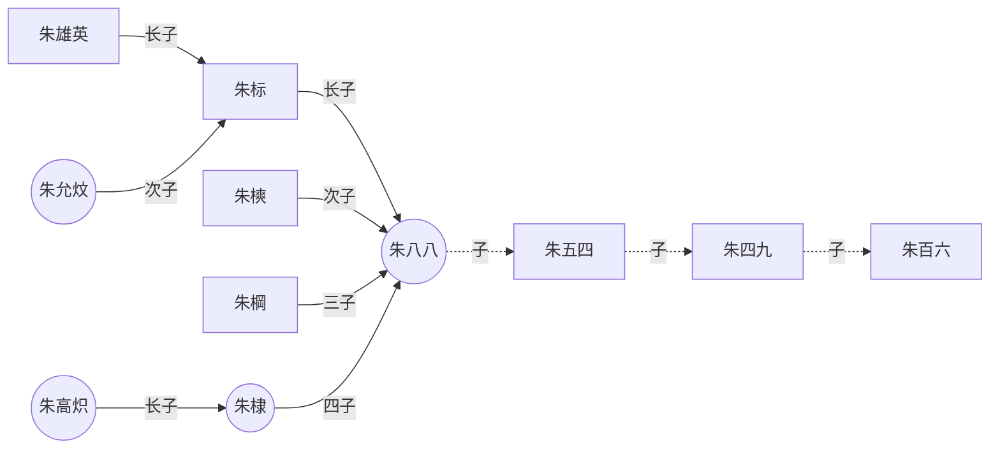


## 饼状图

### 语法——仅供参考，建议直接看实例
- 从`pie`关键字开始图表
-   然后使用`title`关键字及其在字符串中的值，为饼图赋予标题。（这是**可选的**）
-   数据部分
-   在`" "`内写上分区名。
-   分区名后使用`:`作为分隔符
-   分隔符后写上数值，最多支持 2 位小数——数据会以百分比的形式展示

### 实例
```
pie
	title 为什么总是宅在家里？
	"喜欢宅":15
	"天气太热或太冷":20
	"穷":50
```

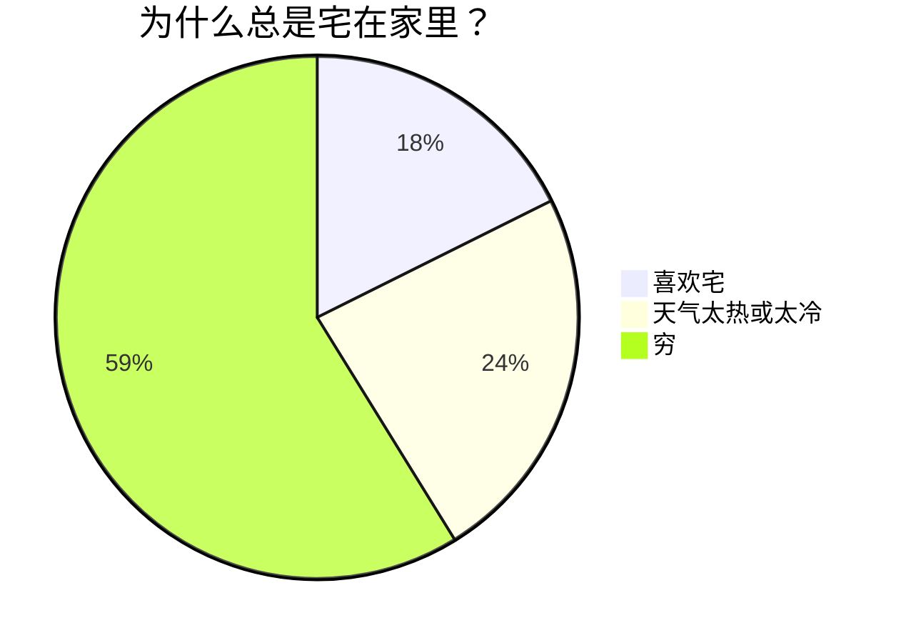


## 流程图

### 实例

```
graph LR  
 A[Start] --> B{Is it?};  
 B -- Yes --> C[OK];  
 C --> D[Rethink];  
 D --> B;  
 B -- No ----> E[End];
```

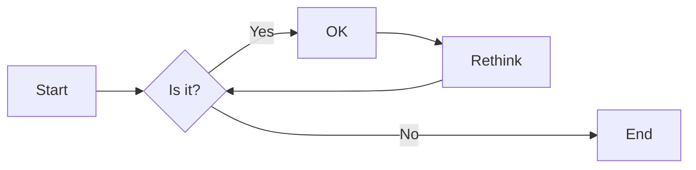

### 方向
用于开头，声明流程图的方向。
-   `graph`或`graph TB`或`graph TD`：从上往下
-   `graph BT`：从下往上
-   `graph LR`：从左往右
-   `graph RL`：从右往左

### 结点
-   无名字的结点：直接写内容，此时结点边框为方形；节点内容不支持空格
-   有名字的结点：节点名后书写内容，内容左右有特定符号，结点边框由符号决定；节点内容可以有空格

> 下面的实例中，没有为 graph 指定方向，因此默认是从上往下的。但是由于各个结点之前没有箭头，所以他们都处于同一排。id1-id6 是节点名，可随意定义。

```
graph  
 默认方形
 id1[方形]  
 id2(圆边矩形)  
 id3([体育场形])  
 id4[[子程序形]]  
 id5[(圆柱形)]  
 id6((圆形))
```


```
graph
 id1{菱形}
 id2{{六角形}}
 id3[/平行四边形/]
 id4[\反向平行四边形\]
 id5[/梯形\]
 id6[\反向梯形/]
```


### 连线样式

#### 实线箭头
>分为无文本箭头和有文本箭头，有文本箭头有 2 种书写格式

```
graph LR  
a-->b--文本1-->c-->|文本2|d  
```

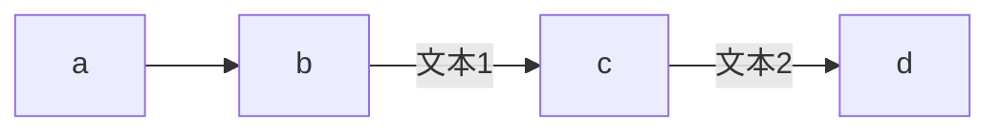

#### 粗实线箭头
>分为无文本箭头和有文本箭头

```
graph LR
a==>b==文本==>c
```

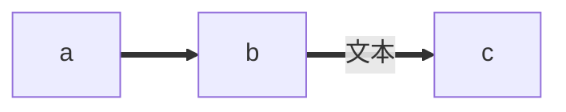

#### 虚线箭头
>分为无文本箭头和有文本箭头

```
graph LR
a-.->b-.文本.->c
```

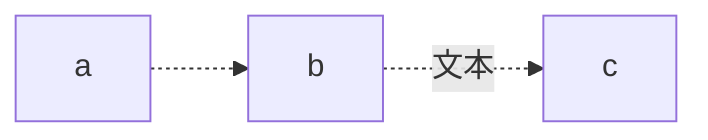

#### 无箭头线
>即以上三种连线去掉箭头后的形式

```
graph LR  
a---b  
b--文本1!---c  
c---|文本2|d  
d===e  
e==文本3===f  
f-.-g  
g-.文本.-h
```

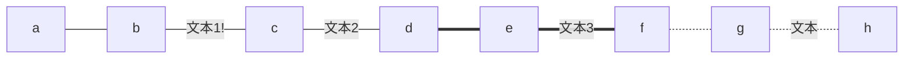

#### 其他连线
>需要将 `graph` 关键字改为 `flowchart`，除了新增加的连线形式外，上面三种线的渲染效果也会不同

```
flowchart LR  
 A o--o B 
 B <--> C
 C x--x D
```


#### 延长连线
>增加相应字符即可，如下图中的 B 到 E，连线中增加了一个`-`。字符可多次添加。

```
graph LR  
 A[Start] --> B{Is it?};  
 B -->|Yes| C[OK];  
 C --> D[Rethink];  
 D --> B;  
 B --->|No| E[End]; 
```

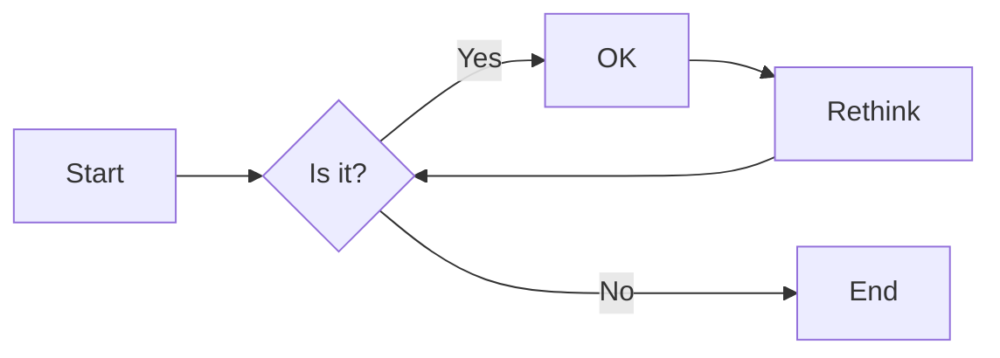

### 连线形式

#### 直链

```
graph LR  
A -- text --> B -- text2 --> C  
```

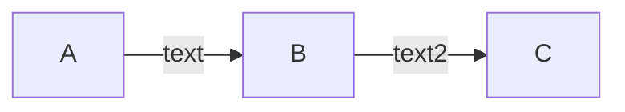

#### 多重链
>可以使用`&`字符，或单个描述

```
graph
 a --> b & c--> d
   
 A & B--> C & D
   
 X --> M
 X --> N
 Y --> M
 Y --> N
```
 
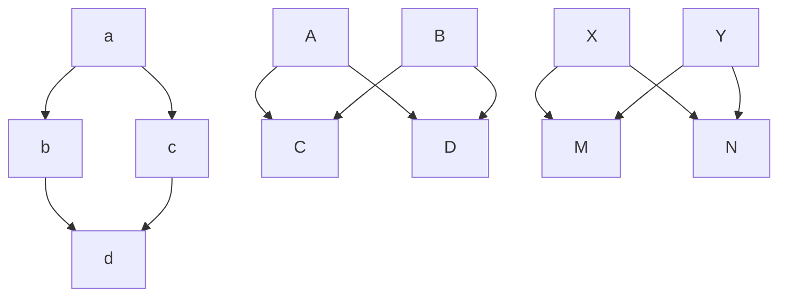

### 其他

#### 子图
>需要将`graph`关键字改为`flowchart`，在代码段的开始加入`subgraph`，尾部加入`end`

```
flowchart TB  
 c1-->a2  
 subgraph one  
 a1-->a2  
 end  
 subgraph two  
 b1-->b2  
 end  
 subgraph three  
 c1-->c2  
 end  
 one --> two  
 three --> two  
 two --> c2  
```

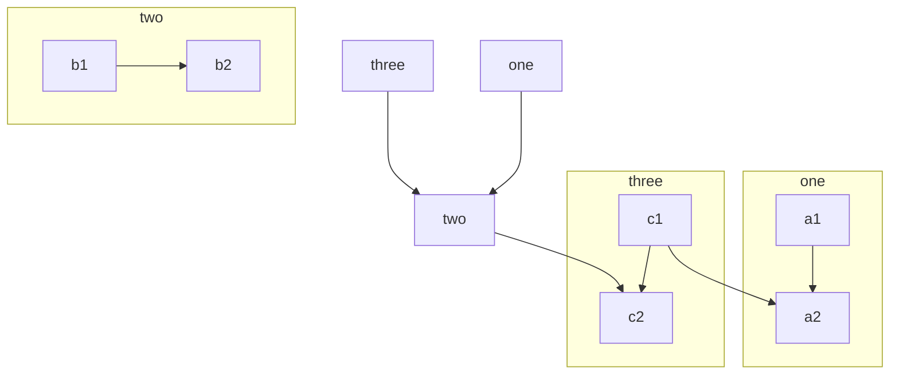
#### 注释
>在行首加入`%%`即可。

```
graph LR  
%%这是一条注释，在渲染图中不可见  
 A[Hard edge] -->|Link text| B(Round edge)  
 B --> C{Decision}  
 C -->|One| D[Result one]  
 C -->|Two| E[Result two]  
```

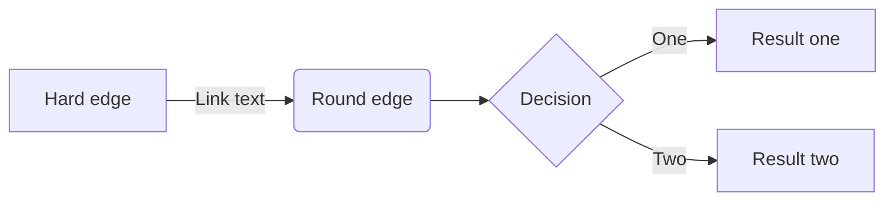