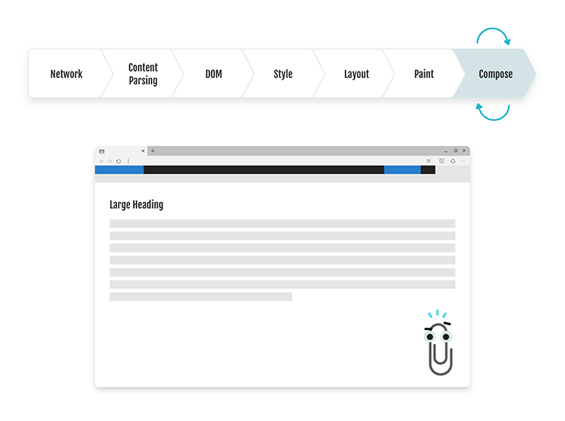

up:: [[• TOC for Frontend](../%E2%80%A2%20TOC%20for%20Frontend.md)

## 解析

一旦 CSS 被浏览器下载，CSS 解析器就会被打开来处理它遇到的任何 CSS。这可以是单个文档内的 CSS、`<style>`标记内的 CSS，也可以是 DOM 元素的`style`属性内嵌的 CSS。所 有 CSS 都根据语法规范进行解析和标记。解析完成后，就会生成有一个包含所有选择器、属性和属性各自值的数据结构。

例如，考虑以下 CSS:

```
.fancy-button {
    background: green;
    border: 3px solid red;
    font-size: 1em;
}
```

以上 CSS 片段将生成如下数据结构，以便在后续的过程中方便使用：

| 选择           | 属性               | 值             |
| -------------- | ------------------ | -------------- |
| `fancy-button` | `background-color` | `rbg(0,255,0)` |
| `fancy-button` | `border-width`     | `3px`          |
| `fancy-button` | `border-style`     | `solid`        |
| `fancy-button` | `border-color`     | `rgb(255,0,0)` |
| `fancy-button` | `font-size`        | `1em`          |

完解析成之后，浏览器引擎继续构建 DOM 树。

## 计算

既然我们已经解析了现有内容中的所有样式，接着就是对它们进行样式计算了。我们尝试尽量对所有值减少到一个标准化的计算值。当离开计算阶段时，任何维度值都被缩减为三个可能的输出之一:`auto`、百分比或像素值。为了清晰起见，让我们看几个例子，看 web 开发人员写了什么，以及计算后的结果:

| Web开发人员                   | 计算值                     |
| ----------------------------- | -------------------------- |
| `font-size: 1em`              | `font-size: 16px`          |
| `width: 50%`                  | `width: 50%`               |
| `height: auto`                | `height: auto`             |
| `width: 506.456456px`         | `width: 506.46px`          |
| `line-height: calc(10px+2em)` | `line-height: 42px`        |
| `border-color: currentColor`  | `border-color: rgb(0,0,0)` |
| `height: 50vh`                | `height: 540px`            |
| `display: grid`               | `display: grid`            |

现在我们已经计算了数据存储中的所有值，是时候处理级联了。

## 级联

由于 CSS 来源有多种，所以浏览器需要一种方法来确定哪些样式应该应用于给定的元素。为此，浏览器使用一个名为 **特殊性 (specificity)** 的公式，它计算选择器中使用的标记、类、id 和属性选择器的数值，以及 `!important` 声明的数值。

通过内联 `style` 属性在元素上定义的样式被赋予一个等级，该等级优先于 `<style>` 块或外部样式表中的任何样式。如果 Web 开发人员使用 `!important` 某个值，则该值将胜过任何 CSS，无论其位置如何，除非还有 `!important` 内联。

同一级别的个数，数量多的优先级高，假设同样即比较下一级别的个数。至于各级别的优先级例如以下：

> [!NOTE] 优先级
> !important > 内联 > id > class > 标签 | 伪类 | 属性选择 > 伪对象 > 通配符 > 继承

选择器的特殊性由选择器本身的组件确定，特殊性值表述为 5 个部分，如：

```
0，0，1，0，1
```

### Specificity 计算公式

- 对于选择器中给定的各个 `!important` 属性值，加 1，0，0，0，0 。
- 对于选择器中给定的各个 ID 属性值，加 0，0，1，0，0 。
- 对于选择器中给定的各个类属性值、属性选择器或伪类，加 0，0，0，1，0 。
- 对于选择器中给定的各个元素和伪元素，加 0，0，0，0，1 。
- 结合符 (+ > [] ^= $= 等等特殊符号) 和通配符 (*) 对特殊性没有任何贡献，此外通配符的特殊性为 0，0，0，0，0。全是 0 有什么意义呢？当然有意义！子元素继承祖先元素的样式根本没有特殊性，因此当出现这种情况后，通配符选择器定义的样式声明也要优先于子元素继承来的样式声明。因为就算特殊性是 0，也比没有特殊性可言要强。

### Specificity 计算范例

| Selector                 | Specificity Score |
| ------------------------- | ----------------- |
| `li`                      | 0 0 0 0 1         |
| `li.foo`                  | 0 0 0 1 1         |
| `#comment li.foo.bar`     | 0 0 1 2 1         |
| `<li style='color: red'>` | 0 1 0 0 0         |
| `color: red !important`   | 1 0 0 0 0         | 

而当优先级与多个 CSS 声明中任意一个声明的优先级相等的时候，CSS 中最后的那个声明将会被应用到元素上。

在下面的示例中，`div` 将具有蓝色背景。

```
div {
  background: red;
}

div {
  background: blue;
}
```

### 初始范例 Specificity 数值表

| Selector            | Property           | Value            | Specificity Score | Document Order |
| ------------------- | ------------------ | ---------------- | ----------------- | -------------- |
| `fancy-button`      | `background-color` | `rgb(0,255,0)`   | 0 0 0 1 0         | 0              |
| `fancy-button`      | `border-width`     | `3px`            | 0 0 0 1 0         | 1              |
| `fancy-button`      | `border-style`     | `solid`          | 0 0 0 1 0         | 2              |
| `fancy-button`      | `border-color`     | `rgb(255,0,0)`   | 0 0 0 1 0         | 3              |
| `fancy-button`      | `font-size`        | `16px`           | 0 0 0 1 0         | 4              |
| `div .fancy-button` | `background-color` | `rgb(255,255,0)` | 0 0 0 1 1         | 5               |

## 来源

### User 用户样式

浏览器还允许用户设置网页的样式，如用 IE 浏览网站的时候，可以通过浏览器查看菜单下的样式或者文字大小子菜单来设置网页实际的显示效果。

###  Author 作者样式

网页创建者建立的样式表，一般会 css 文件出现或者是在页面头部里定义的 style，也就是网站源代码的一部分。

### User Agent 用户代理 / 浏览器样式

浏览器自身设置用来显示网站的样式，不同的浏览器可能有不同的样式表，通常情况下，作者样式具有最高的重要性，其次是用户样式，最后才是浏览器样式，但是如果出现了 `!important` 标记的话，那么规则会被改变，通过 `!important` 可以提高某种样式的重要性，让它的优先级高于其他没有加该声明的所有样式。

## 做级联

当浏览器拥有一个完整的数据结构，包含来自所有源的所有声明时，它将按照规范对它们进行排序。首先，它将按来源排序，然后按特性 (specificity) 排序，最后按文档顺序排序。

| Origin | Selector            | Property           | Value            | Specificity Score | Document Order |
| ------ | ------------------- | ------------------ | ---------------- | ----------------- | -------------- |
| User   | *                   | `font-size`        | `32px`           | 0 0 0 0 1         | 0              |
| Author | `div .fancy-button` | `background-color` | `rgb(255,255,0)` | 0 0 0 1 1         | 5              |
| Author | `.fancy-button`     | `background-color` | `rgb(0,255,0)`   | 0 0 0 1 0         | 0              |
| Author | `.fancy-button`     | `border-width`     | `3px`            | 0 0 0 1 0         | 1              |
| Author | `.fancy-button`     | `border-style`     | `solid`          | 0 0 0 1 0         | 2              |
| Author | `.fancy-button`     | `border-color`     | `rgb(255,0,0)`   | 0 0 0 1 0         | 3              |
| Author | `.fancy-button`     | `font-size`        | `16px`           | 0 0 0 1 0         | 4               |

从上图可知，类名为 `.fancy-button`优先级最高（表中越上面优先级越高）。例如，从上表中，人会注意到用户的浏览器首选项设置优先 于 Web 开发人员的设置样式。现在，浏览器找到与选择器匹配的所有 DOM 元素，并将得到的计算样式挂载到匹配的元素，在本例中 `div` 为类名为 `.fancy-button`：

| Property           | Value            |
| ------------------ | ---------------- |
| `font-size`        | `32px`           |
| `background-color` | `rgb(255,255,0)` |
| `border-width`     | `3px`            |
| `border-color`     | `rgb(255,0,0)`   |
| `border-style`     | `solid`          | 


> [!NOTE] 官方文档
> [官方规范](https://link.segmentfault.com/?enc=eHT3W23Xu0ePFqtMdYlInQ%3D%3D.L1m1ciQDRwlJQY90G2neYhGHc2l%2BSvFCEjX25hQRHkmhZ4zRkiC%2BhTMpC6wL2Twy)。


## CSS 对象模型

更新 [CSS 对象模型 (CSSOM)](https://link.segmentfault.com/?enc=girEZMenn2I80L5PSLjqYw%3D%3D.UZjjQrPMwTAkge%2FQQFe3ELdCerA%2FMFgBcT9QBhekENTkcXK7EOQFgO7jBvotLNA5bjaBgrhwhSmRZ2C9tvQKRz8jY0BSRmiiCsD%2FAmjNORk%3D)。 CSSOM 位于 [`document.stylesheets`](https://link.segmentfault.com/?enc=7KcpXhibDIaxK20H%2BHwhZQ%3D%3D.7HoqCEWbvsEvxp1iUicYAbLwNJKaVcUwlGYShXf%2FKnnUrKnKCHoUiFUz6A6X3hxxWmPfzXrZNrNtxrtNzZXZzNREICPgGwgiqrusIFG%2FEJE%3D) 中，需要对其进行更新，以便它知道目前为止已经解析和计算的所有内容。Web 开发人员可能在没有意识到的情况下使用这些信息。例如，当调用 [getComputedStyle()](https://link.segmentfault.com/?enc=y8RWyBF%2BGcpkxL2EMzaXGw%3D%3D.hcb7IaLUPHAOXmaNUJhZpyWITJjiV8g416y9v19DdAn5TvDzoVCHxv0vNIv%2FKGbWZE%2Bj1oc8eVSXWIMK8edmoM0mDHmytC5QN79kY0xTESU%3D) 时，如果需要，运行上面指出的相同过程

## 布局

现在已经应用了一个具有样式的 DOM 树，然后开始构建一个用于可视化目的的树了。这棵树出现在所有现代引擎中，被称为盒子树 (box tree)。为构造这棵树，需要遍历 DOM 树并创建零个或多个 CSS 盒子，每个盒子都有一个 `margin`、`border`、`padding` 和 `content` 。

* 格式化上下文（FC）：有许多类型的格式化上下文，其中大多数 Web 开发人员通过更改 `display` 元素的值来调用。一些最常见的格式化上下文是块（块格式化上下文或 **BFC**），flex，grid，table-cells 和 inline。其他一些 CSS 也可以强制使用新的格式化上下文，例如 `position: absolute`，`float` 或使用 `multi-colum`。
* 包含块: 这是用于解析样式的祖先块。
* 内联方向：这是文本布局的方向，由元素的书写模式决定。 在拉丁语言中，这是水平轴，在 CJK 语言中，这是垂直轴。
* 块方向：此行为与内联方向完全相同，但与内联轴垂直。因此，对于基于拉丁语的语言，这是垂直轴，而在 CJK 语言中，这是水平轴。

## 解析 Auto

在计算阶段，维度值可以是三个值之一: auto、百分数或像素。布局的目的是在 **Box Tree** 中调整所有盒子的大小和位置，使它们为绘制做好准备。

下面示例可以更容易地理解 **Box Tree** 是如何构建的。为了便于理解，这里不显示单独的 CSS 框，只显示主盒 (principal box)。让我们看看一个基本的 “Hello world” 布局使用以下代码:

```html
<body>
	<p>Hello world</p>
	<style> 
		body {
			width: 50px;
	    } 
    </style>
</body>
```

浏览器从 body 元素开始，生成它的主盒 (principal box)，它的宽度为`50px`，默认高度为`auto`。


现在移动到 `p` 标签并生成其主盒 (principal box)，并且由于 `p` 标签默认有边距（margin），这将影响正文的高度，如下所示：


现在浏览器移动到 **“Hello world”** 文本，这是 DOM 中的文本节点。因此，我们在布局中生成一个 **行内盒 (line box)** 。请注意，文本溢出了正文，我们将在下一步处理这个问题。


因为加上 “world” 长度后实际长度比较设置大并且我们没有设置 `overflow` 属性，所以引擎会向其父级报告它在布局文本时停止的位置。


由于父级已收到其子级无法完成所有内容布局的指令，因此它会克隆包含所有样式的 **行内盒 (line box)**，并传递该框的信息以完成布局。

布局完成后，浏览器会返回 `box tree`，解析尚未解决的所有基于 `auto` 或基于百分比的值。 在图中，可以看到正文和段落现在包含所有 “Hello world”，因为它的 **height** 设置为 `auto`。

## 处理浮动 float

下面的例子，使用一个普通布局，其中有一个按钮，内容为 **“Share It”**，并将其浮动到一段文本的左侧。浮动本身被认为是 **“shrink-to-fit”** 上下文。之所以将其称为 “shrink-to-fit”，是因为如果尺寸是自动的，则该框将围绕其内容进行收缩。

浮动盒子是与这种布局类型匹配的盒子的一种类型，但是还有许多其他的盒子，例如绝对定位盒子 (包括 `position: fixed`) 和基于自动调整大小的表格单元格，如下代码：

```html
<article>
    <button>SHARE IT</button>
    <p>Lorem ipsum dolor sit amet, consectetur adipiscing elit. Nullam pellentesq</p>
</article>
<style> 
	article {
        min-width: 400px;
        max-width: 800px;
        background: rgb(191, 191, 191);
        padding: 5px;
    }

    button {
        float: left;
        background: rgb(210, 32, 79);
        padding: 3px 10px;
        border: 2px solid black;
        margin: 5px;
    }

    p {
        margin: 0;
    } 
</style>
```


该过程开始时遵循与 “Hello world” 示例相同的模式，直接开始处理浮动按钮的位置。


由于浮动创建了一个新的块格式化上下文 (BFC)，并且是一个 `shrink-to-fit` 上下文，因此浏览器执行一种称为内容度量的特定布局类型。

在这种模式下，它看起来与其他布局相同，但有一个重要的区别，即它是在无限空间中完成的。在此阶段，浏览器所做的就是以 BFC 的最大和最小宽度布局 BFC 树。

在本例中，它使用文本布局一个按钮，因此其最窄的大小 (包括所有其他 CSS 框) 将是最长单词的大小。在最宽的地方，它将是一行的所有文本，加上 CSS Box。注意: 这里按钮的颜色不是文字的颜色。这只是为了说明问题。


现在我们知道最小宽度是 86px，最大宽度是 115px，我们将此信息传递回父类的 box，让它决定宽度并适当地放置按钮。在这个场景中，有足够的空间来适应浮动的最大大小，这就是按钮的布局方式。


为了确保浏览器遵循标准，并且内容围绕浮动，浏览器更改了 **article** 的 BFC 的几何形状。这个几何图形被传递给段落，以便在段落布局期间使用。


从这里开始，浏览器遵循与第一个示例相同的布局过程——但是它确保任何内联内容的内联和块的起始位置都位于浮动所占用的约束空间之外。


当浏览器继续沿着树向下移动并克隆节点时，它将越过约束空间的块位置。这允许最后一行文本 (以及它之前的一行) 以内联方向开始于 content box 的开头。然后浏览器返回到树中，根据需要解析 **auto** 和百分数。

## 了解片段 (UNDERSTANDING FRAGMENTATION)

关于布局如何工作的最后一个方面是碎片化。 如果你曾经打印过网页或使用过 CSS 多列，那么你已经利用了碎片。 碎片化是将内容分开以使其适合不同几何形状的逻辑。 让我们来看看同一个例子，利用 CSS 多列情况:

```html
<body>
    <div>
        <p>Lorem ipsum dolor sit amet, consectetur adipiscing elit. Cras nibh orci, tincidunt eget enim et, pellentesque condimentum risus. Aenean sollicitudin risus velit, quis tempor leo malesuada vel. Donec consequat aliquet mauris. Vestibulum ante ipsum primis in faucibus
        </p>
    </div>
<style> 
	body {
        columns: 2;
        column-fill: auto;
        height: 300px;
    } 
</style>
</body>
```


一旦浏览器到达 `multicol` 格式化上下文盒子，它就会看到它有一组设定的列。


它遵循以前类似的克隆模型，并创建了一个具有正确维度的碎片处理程序，以满足作者对其列的要求。


然后浏览器按照与之前相同的模式尽可能多地布局行，然后浏览器创建另一个碎片管理器，并继续完成布局。

## 绘画 (Painting)

对布图应用颜色、边框、阴影和类似的设计处理——处理这些过程被称为**绘画**。绘画基本上是由 CSS 标准化的，可以按照以下顺序绘画:

* background;
* border;
* and content.

更多绘画的顺序可查看 [CSS 2.2 Appendix E](https://link.segmentfault.com/?enc=1bsymY25xxfOh%2FCWTGj2SA%3D%3D.aPkFPhuNFc7BhUDqZKrOKQtE6gTmo2Ge3njXRtMGzKRybZ%2Fe1Pbf88ZFtCmRM%2B1Bw4zEDrOJf8OhyfkPCcEGaw%3D%3D)。

- `SHARE IT` 按钮:


完成后，它将转换为位图，最终每个布局元素（甚至文本）都成为引擎中的图像。

## 组成 (COMPOSITION)

合成程序的工作是创建一个或多个层，并将位图呈现到屏幕上供最终用户查看。

此时一个合理的问题是，“为什么任何站点都需要不止一个位图或合成层?”，根据我们目前看到的例子，我们真的不会这么做。我们来看一个稍微复杂一点的例子。假设在一个假设的世界中，Office 团队想让 Clippy 重新上线，他们想通过 CSS 转换让 Clippy 跳动来吸引人们对他的注意。

动画 Clippy 的代码可以是这样的:

```html
<div class="clippy"></div>
<style> 
.clippy {
    width: 100px;
    height: 100px;
    animation: pulse 1s infinite;
    background: url(clippy.svg);
}

@keyframes pulse {
    from {
        transform: scale(1, 1);
    }
    to {
        transform: scale(2, 2);
    }
} </style>
```

当浏览器读取 web 开发人员希望在无限循环中为 Clippy 添加动画时，它有两个选项:

*   它可以返回到动画的每一帧的重绘阶段，并生成一个新的位图以返回合成器。
*   或者它可以生成两个不同的位图，并允许合成程序仅在应用了该动画的层上执行动画本身。

在大多数情况下，浏览器将选择选项 2 并生成以下内容:


然后，它将重新组合剪辑位图在正确的位置，并处理脉动动画。这对于性能来说是一个很好的优势，因为在许多引擎中，合成程序是在它自己的线程上的，这样就可以解除主线程的阻塞。如果浏览器选择上面的选项 1，它将不得不阻塞每一帧以完成相同的结果，这将对最终用户的性能和响应能力产生负面影响。



## 创造互动的视觉

```html
button {
    float: left;
    background: rgb(210, 32, 79);
    padding: 3px 10px;
    border: 2px solid black;
}

button:hover {
    background: teal;
    color: black;
}
```

浏览器不断跟踪各种输入，当这些输入正在移动时，它会经历称为**命中测试**的过程。 对于此示例，该过程如下所示：


1.  用户将鼠标移到按钮上。
2.  浏览器触发鼠标已移动的事件，并进入命中测试算法，该算法本质上是问 “鼠标正在触摸哪个 box”
3.  该算法返回链接到我们的 “SHARE IT” 按钮。
4.  浏览器会问这个问题:“既然有鼠标在你上方盘旋，我应该做什么?”。
5.  它快速运行此框及其子框的样式 / 级联，并确定`:hover` 在声明块内部有一个仅使用绘制样式调整的伪类。
6.  它将这些样式挂起 DOM 元素（正如我们在级联阶段所学到的），在这种情况下是按钮。
7.  它跳过布局，直接绘制一个新的位图。
8.  新的位图被传递给合成程序，然后传递给用户。
